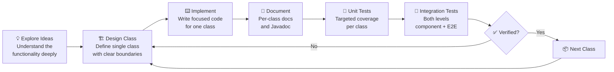

# 2026-07-03

### 🏗️ Atomic Class-by-Class Development — The Right Way to Work with AI

- Spect Driven Development (SDD) is popular, but using it with AI produces terrible results: hallucinations, unnecessary
  code, loss of control
- The proven approach: work on **specific, encapsulated functionality** — one class at a time
- Design every class individually, where you maintain full control over the output
- The resulting code is significantly better across every stage:
    - **Code** — precise, focused, no bloat
    - **Documentation** — accurate per-class docs
    - **Unit tests** — targeted coverage per class
    - **Integration tests** — both levels (component + end-to-end)
- Key insight: explore ideas first to deeply understand the functionality, *then* define class by class
- This is like SDD but far more atomic — dramatically better results

**The cycle is iterative per class:**

1. **Explore** — brainstorm and understand the feature before touching code
2. **Define** — design one class with clear responsibility boundaries
3. **Implement** — write the code for that single class
4. **Document** — add Javadoc and inline docs while the design is fresh
5. **Unit test** — cover every public method of the class
6. **Integration test** — verify it works within the system at both levels
7. **Verify** — if anything fails, loop back to design; if all passes, move to the next class

The result: tighter control, less AI hallucination, code that actually matches the design intent.
