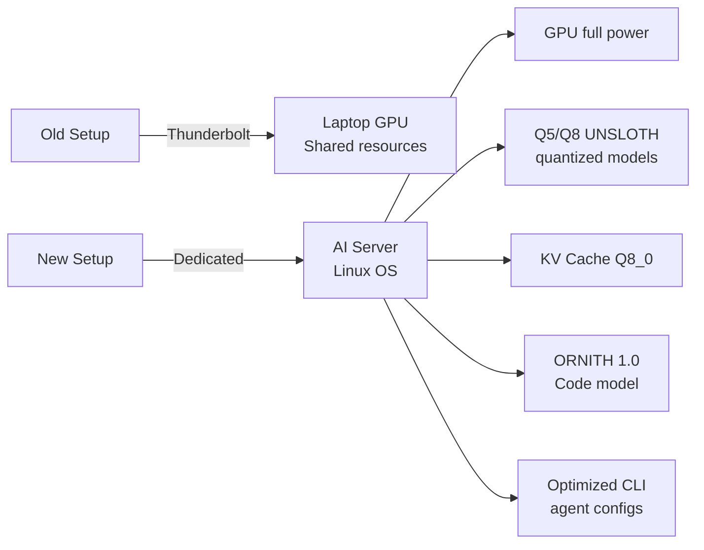

# 2026-07-21

### 🔄 New Dedicated AI Server & Model Setup

- Got a new dedicated AI server — no longer bottlenecked by Thunderbolt connection to laptop
- Linux as primary OS for AI work, compiling dependencies for maximum performance
- Switched to UNSLOTH quantized models: Q5 and Q8 are now the preference
- KV Cache upgraded to Q8_0 — noticeably increases model intelligence and precision
- Using **ORNITH 1.0** model — excellent for code generation, delivering unmatched results
- Adjusted CLI agent configurations alongside the hardware change — fantastic overall improvement
- GPU now gets full power without Thunderbolt limitations

